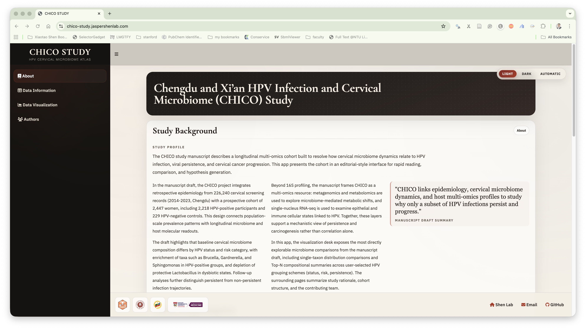

# CHICO Shiny App

Interactive Shiny application for the CHICO study, combining cohort background, participant summaries, and microbiome comparison in an editorial-style interface.



## Highlights

- `About`: study background, cohort context, and manuscript-style overview
- `Data Information`: participant summaries from `sample_info_genus`
- `Data Visualization`: interactive taxon comparison and Top-N composition view
- `Authors`: contributor and institutional information

## Install

```r
remotes::install_github("jaspershen-lab/chico_shiny")
```

## Run

```r
library(chicoshiny)
run_chico_shiny()
```

## Run From Source

Recommended from the repository root:

```r
devtools::load_all()
run_chico_shiny()
```

Manual loading also works:

```r
source("R/utils_paths.R")
source("R/app_ui.R")
source("R/app_server.R")
source("R/run_app.R")
run_chico_shiny()
```

## Visualization Modes

### Single Taxon Distribution

Compare one selected taxon across one or more groups.

- controls: `Level`, `Bacteria`, `Group type`, `Group`
- output: interactive boxplot with jittered points
- hover: `sample_id`, `group`, `abundance`
- statistics:
  - two groups: `Wilcoxon rank-sum test`
  - more than two groups: `Kruskal-Wallis test`

### Top-N Taxa Stacked Bar

Compare compositional patterns across selected groups.

- controls: `Level`, `Top N taxa`, `Group type`, `Group`
- supports two or more groups
- collapses remaining taxa into `Others`
- returns a per-group compositional summary table

## Data Information Page

Built from `sample_info_genus`.

Summary page includes:

- age distribution
- `Affect` pie chart
- `risk` pie chart
- `persistent` pie chart

Participant table includes these columns when available:

- `sample_id`
- `Age`
- `Affect`
- `virus`
- `virus_number`
- `risk`
- `persistent`

## Deployment Notes

The app depends on packaged resources under `inst/`:

- `inst/data/`
- `inst/www/`
- `inst/markdown/`

When deploying to a server, make sure the full project directory is included. Missing `inst/` resources will cause missing images, markdown content, or datasets.

## Troubleshooting

### `Couldn't normalize path in addResourcePath`

Usually caused by running from source without loading the project correctly.

Use:

```r
devtools::load_all()
run_chico_shiny()
```

from the repository root.

### Browser tab shows HTML like `<div class="...">`

This comes from an invalid page title being rendered as HTML text. Redeploy the latest version and hard refresh the browser.

## Project Files

- `R/app_ui.R`: UI
- `R/app_server.R`: server logic
- `R/run_app.R`: launcher
- `R/utils_paths.R`: local/package path helpers
- `inst/markdown/about.html`: About page content
- `inst/markdown/authors.html`: Authors page content

## Entry Point

```r
run_chico_shiny()
```
