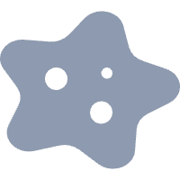

```{css, echo=FALSE}
.description {
  font-size: 1.45rem;
  line-height: 1.5;
  color: #4A4A4A;
  max-width: 860px;
  margin-top: 10px;
  margin-bottom: 20px;
}

.figure-container {
  text-align: center;
  margin-bottom: 30px;
}

.figure-container img {
  max-width: 100%;
  border-radius: 12px;
  box-shadow: 0 2px 16px rgba(0,0,0,0.08);
}

.cards-container {
  display: grid;
  grid-template-columns: repeat(4, 1fr);
  gap: 24px;
  margin-top: 5px;
}

.card {
  background: #F5F5F5;
  border: 1px solid #EAEAEA;
  border-radius: 16px;
  padding: 36px 24px;
  display: flex;
  flex-direction: column;
  align-items: center;
  text-align: center;
  gap: 18px;
  box-shadow: 0 2px 12px rgba(0,0,0,0.05);
  transition: transform 0.25s ease, box-shadow 0.25s ease;
}

.card:hover {
  transform: translateY(-4px);
  box-shadow: 0 6px 24px rgba(0,0,0,0.1);
}

.card-icon {
  width: 56px;
  height: 56px;
  border-radius: 14px;
  display: flex;
  align-items: center;
  justify-content: center;
}

.card-icon img {
  width: 32px;
  height: 32px;
}

.icon-green  { background: #E8F0EC; }
.icon-red    { background: #FCE8E8; }
.icon-orange { background: #FFF3E0; }
.icon-blue   { background: #E8EAF6; }

.card-number {
  font-size: 2.4rem;
  font-weight: 700;
  color: #1A1A1A;
  line-height: 1;
}

.card-label {
  font-size: 1.25rem;
  font-weight: 500;
  color: #7A7A7A;
  line-height: 1.8;
}

@media (max-width: 768px) {
  .cards-container { grid-template-columns: repeat(2, 1fr); }
  .description { margin-top: 30px; margin-bottom: 30px; }
  .figure-container { margin-bottom: 40px; }
}
@media (max-width: 480px) {
  .cards-container { grid-template-columns: 1fr; }
}
```

<div class="description">
The CHICO study established a large-scale, prospective longitudinal cohort to investigate the complex interplay between the cervical microbiome, HPV infection dynamics, and cervical cancer progression. By tracking microbial and viral shifts over time, this research aims to uncover the fundamental mechanisms underlying HPV-driven carcinogenesis in Chinese women.
</div>

<div class="figure-container">

</div>

<div class="cards-container">

<div class="card">
<div class="card-icon icon-green">

</div>
<div class="card-number" data-target="2447">0</div>
<div class="card-label">Total Cohort</div>
</div>

<div class="card">
<div class="card-icon icon-red">

</div>
<div class="card-number" data-target="2218">0</div>
<div class="card-label">HPV-Positive Participants</div>
</div>

<div class="card">
<div class="card-icon icon-orange">

</div>
<div class="card-number" data-target="1820">0</div>
<div class="card-label">High-Risk HPV Carriers</div>
</div>

<div class="card">
<div class="card-icon icon-blue">

</div>
<div class="card-number" data-target="354">0</div>
<div class="card-label">Low-Risk HPV Carriers</div>
</div>

</div>

<br><br><br><br><br>

<script>
(function() {
  function animateCount(el, target, duration) {
    var startTime = null;
    function step(timestamp) {
      if (!startTime) startTime = timestamp;
      var progress = Math.min((timestamp - startTime) / duration, 1);
      var eased = 1 - Math.pow(1 - progress, 3);
      var current = Math.floor(eased * target);
      el.textContent = current.toLocaleString();
      if (progress < 1) {
        requestAnimationFrame(step);
      } else {
        el.textContent = target.toLocaleString();
      }
    }
    requestAnimationFrame(step);
  }

  function initCounters() {
    var counters = document.querySelectorAll('.card-number[data-target]');
    if (counters.length === 0) return false;

    if ('IntersectionObserver' in window) {
      var observer = new IntersectionObserver(function(entries) {
        entries.forEach(function(entry) {
          if (entry.isIntersecting) {
            var el = entry.target;
            var target = parseInt(el.getAttribute('data-target'), 10);
            animateCount(el, target, 1500);
            observer.unobserve(el);
          }
        });
      }, { threshold: 0.3 });

      counters.forEach(function(counter) {
        observer.observe(counter);
      });
    } else {
      counters.forEach(function(el) {
        var target = parseInt(el.getAttribute('data-target'), 10);
        animateCount(el, target, 1500);
      });
    }
    return true;
  }

  if (!initCounters()) {
    var attempts = 0;
    var poller = setInterval(function() {
      attempts++;
      if (initCounters() || attempts > 25) {
        clearInterval(poller);
      }
    }, 200);
  }
})();
</script>
